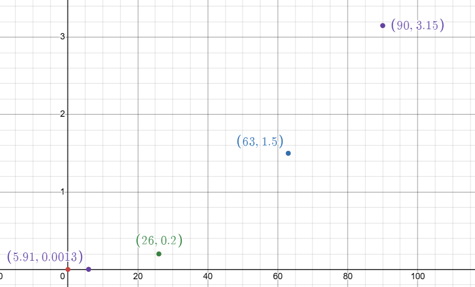
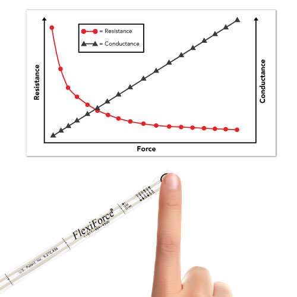

# Resultaten FSR met simpele pull-down weerstand (10kE)

F: R = U/I
Rpulldown = 10kE | Rfsr (noload) > 2000 kE

## Als Rf/R2 niet ingedrukt

Vout ~= 0 V

## Als Rf/R2 ingedrukt
Vin >= Vout > 0 V 

## Testen met vaste gewichten Vin = 3.3V
Testmethode: Vcc = 3.3V altijd gewichten verwijderen voor volgend testresultaat 
Vout = Vcc * R0/(R0+Rs) = 3.3 * 10000/(10000+Rs)

### Sensor 2 Newton (~2kg)
Rfsr (noload) > 2000 kE

Gewicht (g) met weegschaal | Vout(min) (V) | Vout(rms) (V) | R_FSR (Ω)| voorwerp
------------------------|----------|---------|------------------------|----------|
0                       | 0        | 0 | >2000kE            | geen gewicht 
20                      | 1.44      | 1.52 | x           | glazen kurk
24                      | 2.00      | 2.08 | x          | glazen kurk + plastiek gadget
31                      | 2.24      | 2.32 | x           | glazen kurk + plastieke munt
35                      | 2.40      | 2.48 | x          | glazen kurk + plastieke munt + plastiek gadget
42                      | 2.56      | 2.64 | x          | glazen kurk + 2 plastieke munt
46                      | 2.64      | 2.72 | 3k          | glazen kurk + 2 plastieke munt + plastiek gadget
114                      | 2.72      | 2.84 | 500E         | glazen kurk + kaars 1
236                     | 2.96      | 3.04 | 300E          | glazen kurk + kaars 2
498 +20                     | 2.96      | 3.04 | 300E        | glazen kurk + kaars 3
?                    | 3.04      | 3.12 | x           | glazen kurk + max pressure human
...

Deze sensor werkt goed voor 20–500 g, maar verzadigt rond 3V (>500 g).

### Sensor 1 (0-150kg)
Rfsr (noload) > 2000 kE

Gewicht (kg) met weegschaal | Vout (V)  | R_FSR (Ω) | voorwerp
------------------------|-----------|-------------|----------|
0                       | 0         | >2000k          | geen gewicht / kurk
1.255                    | 0.036m     |  >2000k           | gymgewicht 1.25kg
2.324                    | 0.036m     | >2000k           | gymgewicht 2.5kg
3.579                    | 0.050m | >2000kE           | gymgewicht 2.5kg + 1.25
4.655                    | 0.100m | >2000k           | 2 x gymgewicht 2.5kg
5.910                    | 0.130m | >2000k          | 2 x gymgewicht 2.5kg + 1.25
26.000                    | 0.02 | 1500-1700k          | koeler  26kg   aan de 2000 kE grens|
... ||| metingen puur met multimeter
... ||| best > 30 kg om te meten
63.000 | x | 10k-12k | persoon x
... | x |  | persoon z
90.000                    | 3.15 | 200-450          | persoon y => max. gewicht |
...

**Vout = Vcc x R / (R + Rfsr)**  
2000kE : Vout ≈ 3,3/201 ≈ 0.016 V  
1500kE : Vout ≈ 3,3 x (10/(10 + 1500)) ≈ 0.02 V  
10kE : Vout ≈ 3,3 x (10/(10 + 10)) ≈ 1.5 V  
450E: Vout ≈ 3,3 x (10/(10+ 0,45)) ≈ 3,15 V

Deze sensor meet pas vanaf ~25 kg betrouwbaar, optimaal bereik voor 3.3V is 30–90 kg.

## Conclusies

FSR-sensoren zijn niet lineair: De weerstand daalt exponentieel met toenemende kracht, wat leidt tot een afnemende spanningsverandering bij hogere belastingen.

Dode zone bij lichte belasting – Beide sensoren vertonen vrijwel geen Vout voor gewichten onder ~10 kg (Sensor 1) of onder ~20 g (Sensor 2). Pas boven drempelwaarde treedt meetbare verandering op.

Grafiek toont typische FSR-kromme – Steile stijging in lage belasting, daarna afvlakking (verzadiging).

## Verdere stappen

1. Data doorgeven aan PC
    - Serieel (USB-UART) – Meest eenvoudig: stuur Vout-waarden als ASCII via Serial.print() naar PC.
    - ADC uitlezen (ESP32) – analoge pin, sample rate ≥ 10 Hz. (done)

2. Grafiek displayen (real-time of offline)

3. Zithouding herkennen via grafiekanalyse

